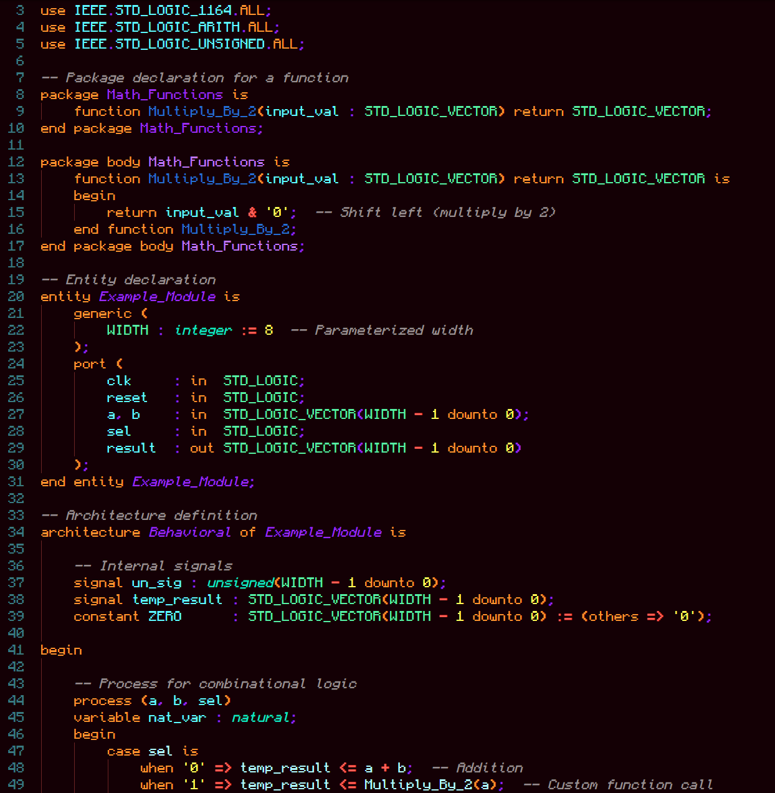

# Cyberpunk 2077 Inspired Theme - VS Code

## Current Release: 1.1.0

### Syntax highlight support
    - Python (and some jupyter)
    - VHDL

### Future improvements
More syntax highlighting support will be added in the future

## Syntax Refrence
N.B. This theme does not change font. The font displayed in examples is Monocraft. The theme will use the font set as default in vs code.

